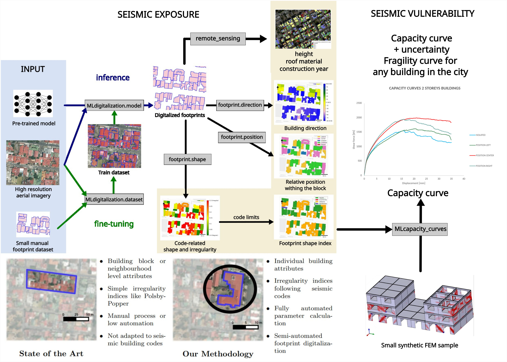

# Towards a Seismic Digital and Hybrid Twin
### An AI-Assisted Framework for Scalable Exposure and Vulnerability Assessment of Buildings in Data-Scarce Urban Environments

**Master Thesis — MEng in Civil Engineering (Ingeniería de Caminos, Canales y Puertos)**  
**Universidad Politécnica de Madrid (UPM)**, ETSI de Caminos, Canales y Puertos  

**Author:** [Miguel Ureña Pliego](https://github.com/MiguelUrenaPliego)  
**Supervisor:** Miguel Marchamalo Sacristán  
**Academic Year:** 2025-2026

---

## 🌐 Project Links
*   **📄 Full Thesis (PDF):** [TFM_Miguel_Ureña.pdf](https://github.com/MiguelUrenaPliego/MasterThesis/blob/main/thesis.pdf)
*   **🖥️ Defense Presentation (Interactive):** [View Presentation](https://miguelurenapliego.github.io/MasterThesis/) 

---

## 📌 Abstract
This research proposes a **"Hybrid Twin"** framework that transforms open geospatial data into actionable structural engineering knowledge. By combining **Computer Vision**, **Remote Sensing**, and **Physics-Informed Machine Learning**, this workflow enables city-scale seismic risk assessments in settings where official building inventories are missing. The framework was validated in three pilot regions (Guatemala City, San José, and Santo Domingo) within the **ADELANTE 2** international cooperation project.

### 🖼️ Graphical Abstract
<p align="center">
  
  <br><em>The complete Hybrid Twin workflow: From raw imagery to building-specific vulnerability.</em>
</p>

---

## 🛠️ Key Components

### 1. AI-Assisted Footprint Digitalization
The first bottleneck in seismic risk is building inventories. This framework utilizes foundation models to automate the extraction of building footprints from high-resolution aerial and satellite imagery.
*   **Mask2Former:** Fine-tuned for rapid, unsupervised "one-shot" instance segmentation.
*   **SAM2 (Segment Anything Model 2):** Used for human-in-the-loop refinement, allowing precise geometry capture in dense urban fabrics.

<p align="center">
  
  <br><em>SAM2-assisted segmentation in dense urban environments.</em>
</p>

### 2. Automated Attribute Extraction & Structural Inference
We translate qualitative seismic design guidelines (**Eurocode 8, ASCE-7, NTC-23, and GNDT**) into deterministic geometric algorithms.
*   **The Building's DNA:** Automated calculation of slenderness, eccentricity, and compactness.
*   **Block Context:** A "contact force" analogy algorithm determines the building's relative position (Isolated, Lateral, Corner, or Confined).
*   **Remote Sensing:** Automated height estimation via DTM/DSM subtraction and unsupervised roof material classification.
*   **Structural System Classifier:** A machine learning model (Logistic Regression/XGBoost) that predicts the building typology (Concrete, Masonry, Adobe) using only observable geospatial proxies.

<table align="center">
  <tr>
    <td align="center"><br><em>Structural Behavior Modifiers (DNA)</em></td>
  </tr>
</table>

### 3. Capacity Curve Estimation (GPR Model)
To scale vulnerability assessment, the framework replaces computationally expensive Finite Element (FEM) simulations with a **Gaussian Process Regression (GPR)** surrogate model.
*   **FEM Training:** Thousands of pushover analyses were performed in **OpenSees** on idealized building aggregates.
*   **GPR Inference:** The model performs functional regression to predict building-specific capacity curves with explicit uncertainty quantification (error bounds), enabling the generation of fragility curves for every building in the city.

<p align="center">
  
  <br><em>Capacity curve model prediction.</em>
</p>

---

## 📦 Developed Python Packages
The core logic of this thesis is available through the following open-source repositories:

| Repository | Description |
| :--- | :--- |
| [**SeismicBuildingExposure**](https://github.com/GeomaticsCaminosUPM/SeismicBuildingExposure) | End-to-end workflow for seismic risk exposure and behavior modifiers. |
| [**GeoVisionDataset**](https://github.com/GeomaticsCaminosUPM/GeoVisionDataset) | Tools for creating ML-ready datasets from aerial imagery and OGC services. |
| [**GeoVisionModels**](https://github.com/GeomaticsCaminosUPM/GeoVisionModels) | Fine-tuning scripts for vision foundation models (SAM2, Mask2Former). |
| [**UrbanAccessAnalyzer**](https://github.com/CityScope/UrbanAccessAnalyzer) | Accessibility and evacuation analysis tools for urban resilience. |

---

## 📚 Related Publications
*   **Footprint attributes:** *A Methodology for the Automated Estimation of Seismic Behaviour Modifiers from Building Footprints.* (**Springer**, 2026).
*   **Transport surface segmentation:** *Transport-Related Surface Detection with Machine Learning.* (**Elsevier**, 2025).
*   **Building height estimation:** *Automatic Building Height Estimation: ML Models for Urban Image Analysis.* (**MDPI**, 2024).

---

## 🤝 Collaborations
This work was developed in collaboration with:
*   Advanced Geomatics Group (**AGA**) & ETSI Forestales, **UPM** (Spain).
*   City Science Group, **MIT Media Lab** (USA).
*   Institute of Transportation, **TU Wien** (Austria).
*   **PIMM** Lab, **ENSAM** Institute of Technology (France).
*   **INTEC** (Dominican Republic), **UCR** (Costa Rica), and **USAC** (Guatemala).

---

## ⌨️ Local Marp Rendering
To render the presentation locally:

```bash
# Install Marp CLI
npm install -g @marp-team/marp-cli

# Render to HTML (Recommended for interactive maps)
marp --html --allow-local-files presentation.md -o presentation.html

# Export to PDF
marp --html --allow-local-files presentation.md -o presentation.pdf