<!-- _class: title two-line-logos -->
<h1></h1>
<h2></h2>

---

<!--header: "Background"-->

# Seismic risk

$$
\text{Risk} =
\text{Hazard} \;\cdot\;
\text{Exposure} \;\cdot\;
\text{Vulnerability}
$$

---

<!-- header: "Background" -->
<!-- _class: col2-50 -->

# ADELANTE 2

- International Cooperation Project

- 3 pilot neighbourhoods  
  - Guatemala City District 1  
  - San José (Costa Rica)  
  - Santo Domingo (Dominican Republic)

- Field surveys: structural material + other parameters

- Remote surveys (QGIS)

- Manual footprint segmentation

<a href="https://www.mideplan.go.cr/proyecto-de-cooperacion-triangular-busca-contribuir-reducir-el-riesgo-sismico-en-latinoamerica">
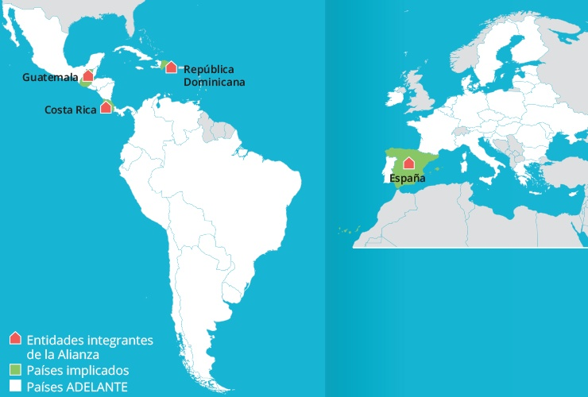
</a>

---

<!--header: "Background"-->

# Seismic risk

$$
\text{Risk} =
\text{Hazard} \;\cdot\;
\fbox{\text{Exposure}} \;\cdot\;
\fbox{\text{Vulnerability}}
$$

---

<!--header: "Background"-->

#  

$$
\text{Risk} =
\text{Hazard} \;\cdot\;
\fbox{\text{Exposure}} \;\cdot\;
\text{Vulnerability}
$$

---

<!--header: "Introduction"-->

# The building's DNA

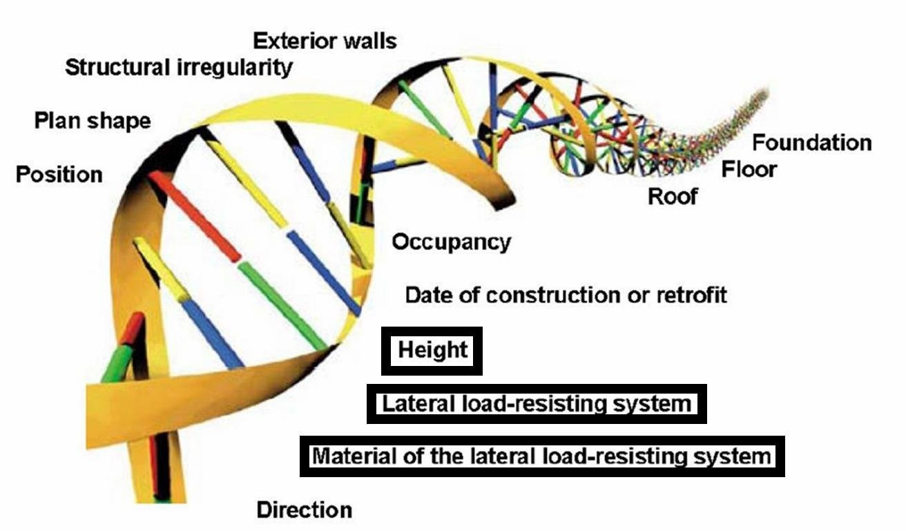

---

<!-- header: "Introduction" -->
<!-- _class: col2-55 img-align img-align-0 -->

# Two different worlds...

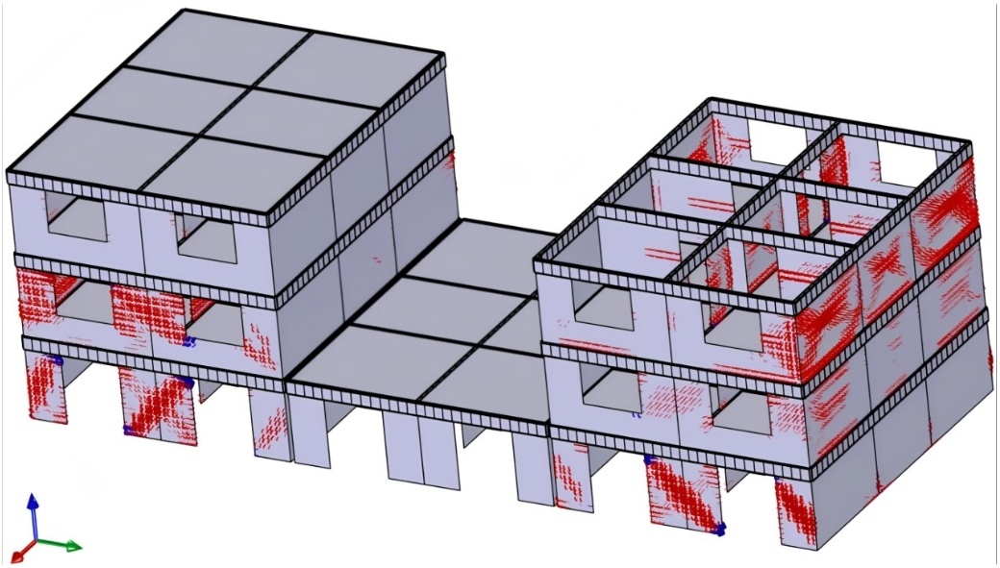

Structural engineering

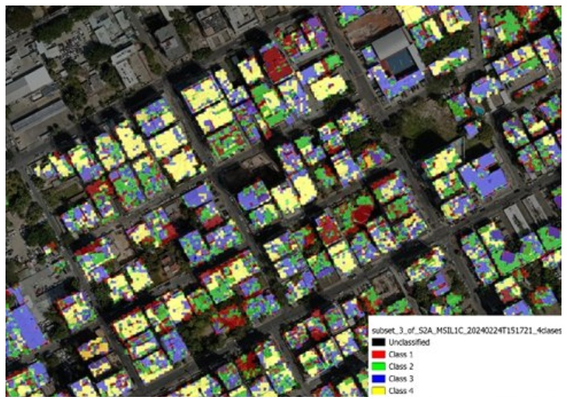

Remote sensing

---

<!-- header: "Methodology" -->
<!-- _class: col2-50 -->

# Step 1. Footprint segmentation

- Mask2Former: instance segmentation fine-tuned model  

- SAM2: assisted segmentation 

- Microsoft GlobalMLBuildingFootprints dataset  

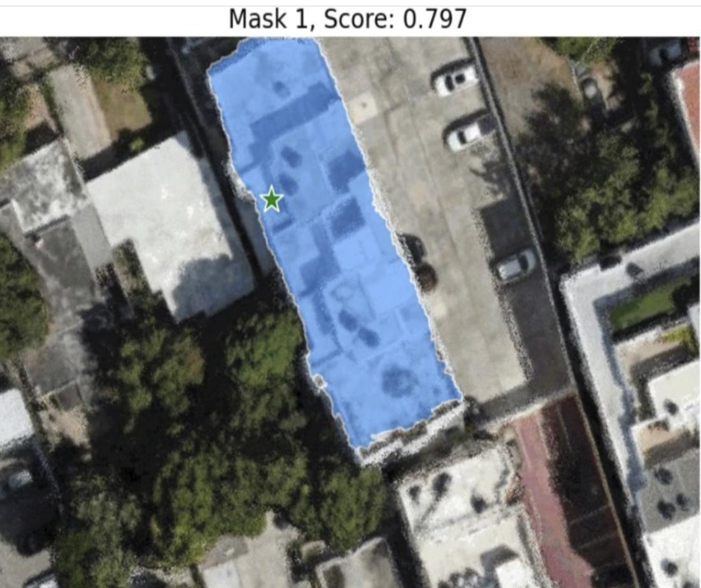

SAM2 example

---

<!--header: ""-->
<!-- _class: col2-50 -->

# Step 1. Results

<table style="border-collapse:collapse; width:100%;">

<thead>
<tr>
<th style="border:1px solid #999; padding:10px 18px;">Metric</th>
<th style="border:1px solid #999; padding:10px 28px;">Mask2Former</th>
<th style="border:1px solid #999; padding:10px 28px;">SAM2</th>
<th style="border:1px solid #999; padding:10px 28px;">Microsoft</th>
</tr>
</thead>

<tbody>

<tr>
<td style="border:1px solid #999; padding:10px 18px;">AJ</td>
<td style="border:1px solid #999; padding:10px 28px;">0.580</td>
<td style="border:1px solid #999; padding:10px 28px;">0.630</td>
<td style="border:1px solid #999; padding:10px 28px;">0.099</td>
</tr>

<tr>
<td style="border:1px solid #999; padding:10px 18px;">SBD</td>
<td style="border:1px solid #999; padding:10px 28px;">0.560</td>
<td style="border:1px solid #999; padding:10px 28px;">0.737</td>
<td style="border:1px solid #999; padding:10px 28px;">0.124</td>
</tr>

<tr>
<td style="border:1px solid #999; padding:10px 18px;">PQ</td>
<td style="border:1px solid #999; padding:10px 28px;">0.446</td>
<td style="border:1px solid #999; padding:10px 28px;">0.530</td>
<td style="border:1px solid #999; padding:10px 28px;">0.002</td>
</tr>

<tr>
<td style="border:1px solid #999; padding:10px 18px;">mAP</td>
<td style="border:1px solid #999; padding:10px 28px;">0.224</td>
<td style="border:1px solid #999; padding:10px 28px;">0.277</td>
<td style="border:1px solid #999; padding:10px 28px;">0.0003</td>
</tr>

<tr>
<td style="border:1px solid #999; padding:10px 18px;">sAP</td>
<td style="border:1px solid #999; padding:10px 28px;">0.370</td>
<td style="border:1px solid #999; padding:10px 28px;">0.526</td>
<td style="border:1px solid #999; padding:10px 28px;">0.044</td>
</tr>

</tbody>

</table>

  

    

      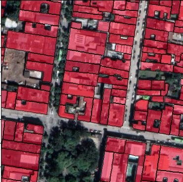
    

    
Guatemala GT

  

  

    

      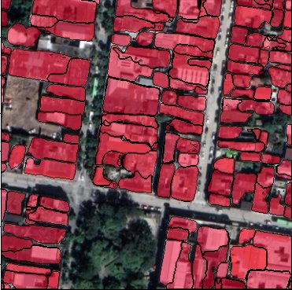
    

    
Mask2Former

  

  

    

      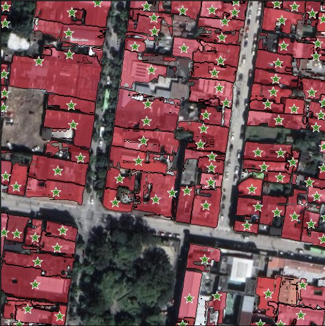
    

    
SAM2

  

  

    

      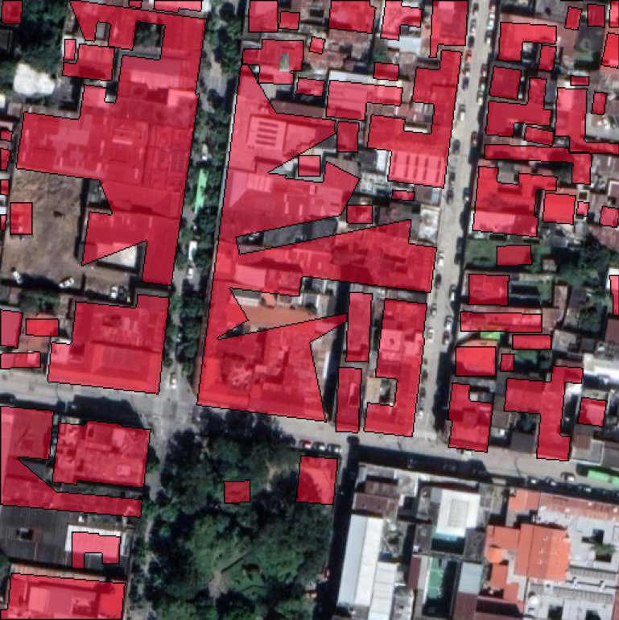
    

    
Microsoft

  

--- 

<!--header: "Use case"-->

# [Transport surface segmentation](https://www.sciencedirect.com/science/article/pii/S2352938525000564?via%3Dihub)

  

---

<!-- _class: no-header no-margin no-footer -->

<iframe
  src="maps/madrid_transport_map.html"
  style="width: 100%; height: 100%; border: w; margin-top: 0rem">
</iframe>

---

<!-- header: "Methodology" -->
<!-- _class: col2-50 img-align img-align-70 -->

# Step 2. Relative position

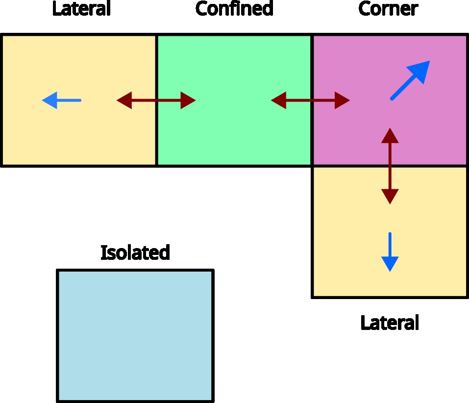

Relative position concept

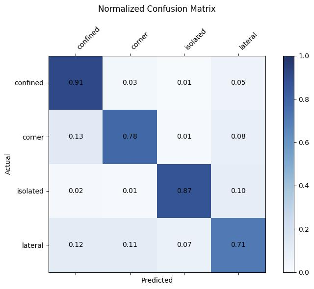

Relative position results

---

<!-- _class: no-header no-margin no-footer -->

<iframe
  src="maps/pilot_regions_map.html"
  style="width: 100%; height: 100%; border: w; margin-top: 0rem">
</iframe>

---

<!-- header: "Methodology" -->
<!-- _class: col2-50 img-align img-align-80 -->

# Step 3. Shape: Basic footprint sizes

Eccentricity

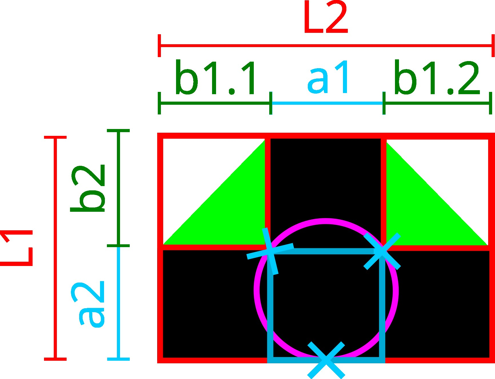

GNDT basic sizes

---

<!-- header: "Use case" -->
<!-- _class: col2-50 img-align img-align-73 -->

# Step 3. Shape: Results

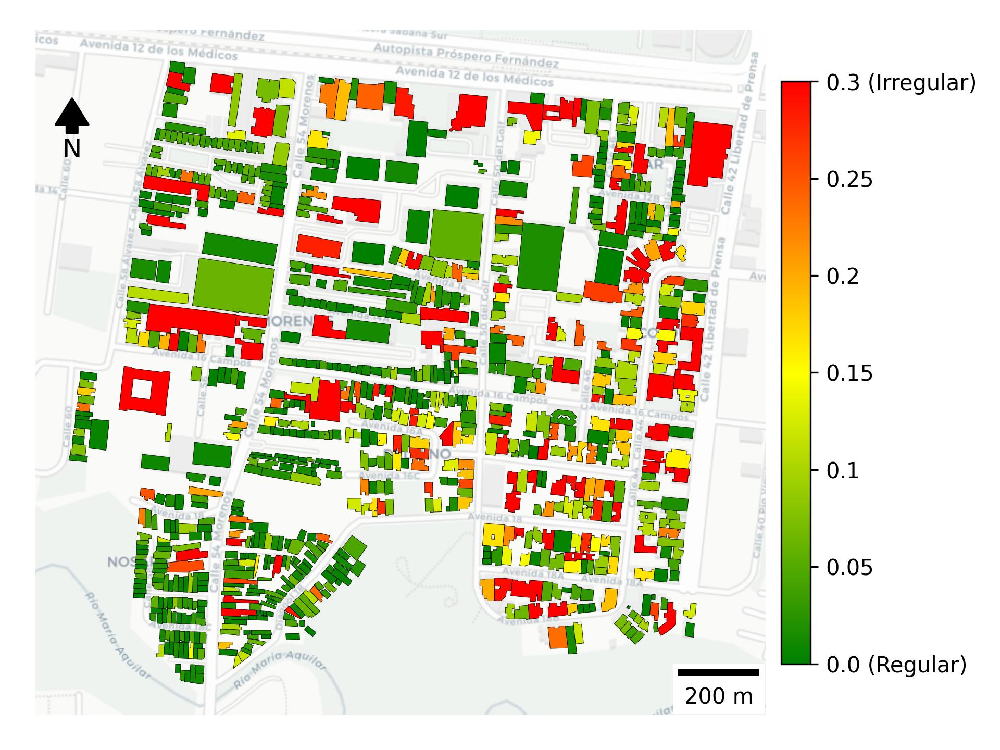

Eccentricity

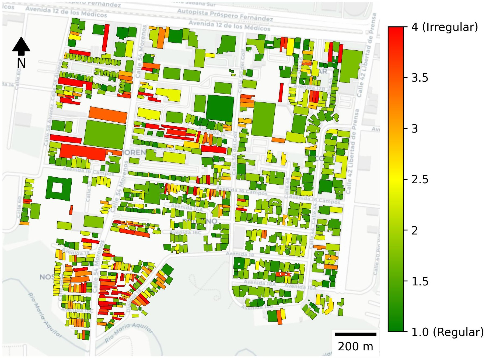

Slenderness in San José (Costa Rica)

---

<!--
header: "Use case"
-->

# [Footprint attributes](https://link.springer.com/article/10.1186/s40323-026-00323-y)

  <a href="https://link.springer.com/article/10.1186/s40323-026-00323-y">
    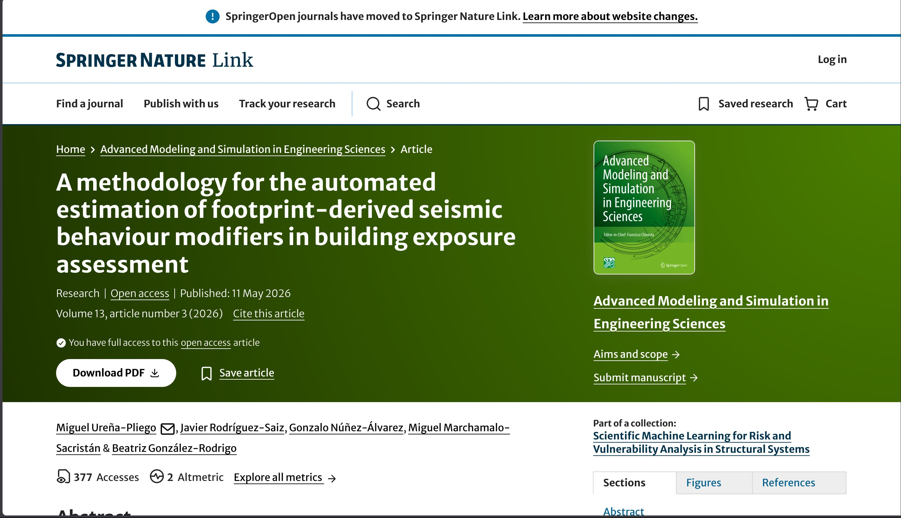
  </a>

---

<!-- _class: no-header no-margin no-footer -->

<iframe
  src="maps/pilot_regions_map.html"
  style="width: 100%; height: 100%; border: w; margin-top: 0rem">
</iframe>

---

<!--
header: "Methodology"
-->

# Step 4. Height

- Aerial imagery: drone, plane or high-resolution satellite imagery  

- Photogrammetry → Digital Surface Model (DSM)  
- Street elevations → Digital Terrain Model (DTM)  
- <b>Height = DSM − DTM</b>

  

    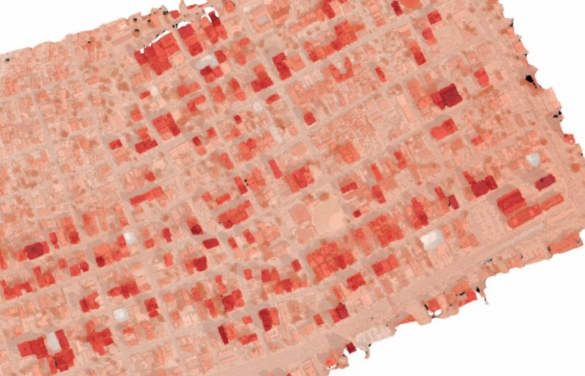
  

  

  <em>DSM – Santo Domingo (DR)</em>

  

---

<!-- header: "Methodology" -->
<!-- _class: col2-50 img-align img-align-70 -->

# Step 5. Remote sensing

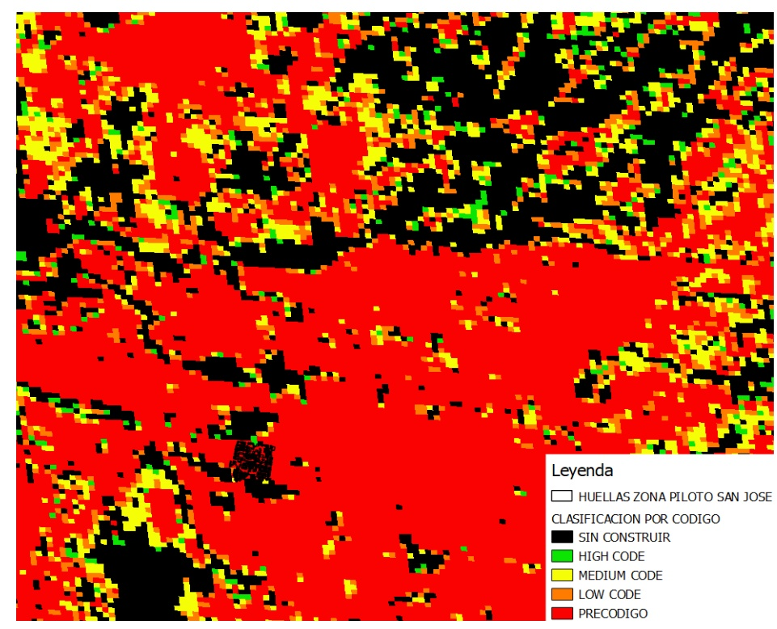

Year of first construction

Unsupervised multispectral classification

---

<!-- _class: no-header no-margin no-footer -->

<iframe
  src="maps/remote_sensing.html"
  style="width: 100%; height: 100%; border: w; margin-top: 0rem">
</iframe>

---

<!-- header: "Methodology" -->
<!-- _class: col2-45 img-align img-align-60 -->

# Step 6. Structural system classifier

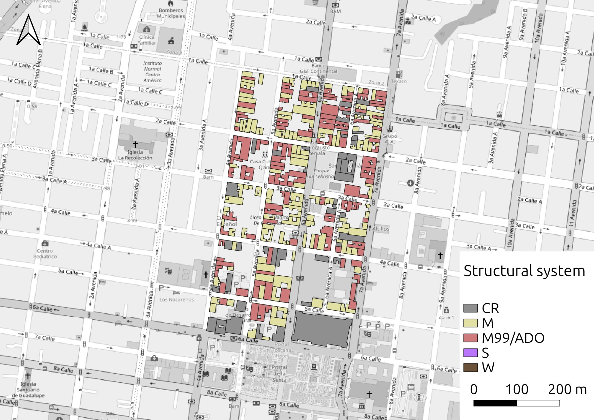

Structural system prediction

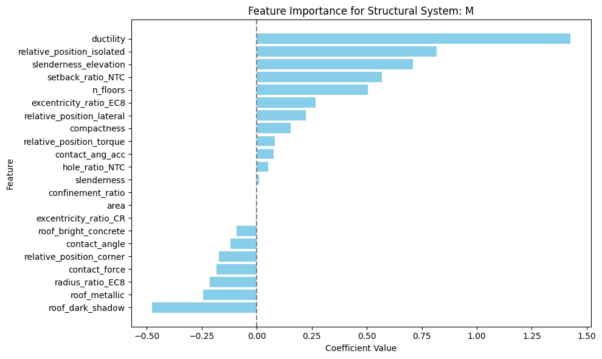

SHAP values for Logistic Regression

---

<!-- _class: no-header no-margin no-footer -->

<iframe
  src="maps/ml_results_map.html"
  style="width: 100%; height: 100%; border: w; margin-top: 0rem">
</iframe>

---

<!--header: ""-->

$$
\text{Risk} =
\text{Hazard} \;\cdot\;
\text{Exposure} \;\cdot\;
\fbox{\text{Vulnerability}}
$$

---

<!-- header: "Methodology" -->
<!-- _class: col2-50 img-align -->

# Step 7. Capacity curve generation

- Idealized building configurations 

- Auto generation of FEM models  

- Capacity curve training set 

- Functional regression model 

- Inference with real building params  

Finite Element Model in OpenSees

--- 

<!-- header: "Methodology" -->
<!-- _class: img-align img-align-0 -->

# Step 7. Capacity curve generation

<table style="border-collapse:collapse; font-size:20px; text-align:center">

<thead>
<tr>
<th style="border:1px solid #999; padding:10px 18px;">Metric</th>
<th style="border:1px solid #999; padding:10px 28px;">Without Bias Correction</th>
<th style="border:1px solid #999; padding:10px 28px;">With Conservative Bias</th>
</tr>
</thead>

<tbody>

<tr>
<td style="border:1px solid #999; padding:10px 18px;">R2 Score</td>
<td style="border:1px solid #999; padding:10px 28px;">0.795</td>
<td style="border:1px solid #999; padding:10px 28px;">0.776</td>
</tr>

<tr>
<td style="border:1px solid #999; padding:10px 18px;">RMSE</td>
<td style="border:1px solid #999; padding:10px 28px;">0.161</td>
<td style="border:1px solid #999; padding:10px 28px;">0.168</td>
</tr>

<tr>
<td style="border:1px solid #999; padding:10px 18px;">MAE</td>
<td style="border:1px solid #999; padding:10px 28px;">0.097</td>
<td style="border:1px solid #999; padding:10px 28px;">0.107</td>
</tr>

<tr>
<td style="border:1px solid #999; padding:10px 18px;">% Below</td>
<td style="border:1px solid #999; padding:10px 28px;">51.0%</td>
<td style="border:1px solid #999; padding:10px 28px;">72.1%</td>
</tr>

</tbody>

</table>

Gaussian process regression results

---

<!--
header: "Methodology"
-->

# Step 6. Capacity curve generation

  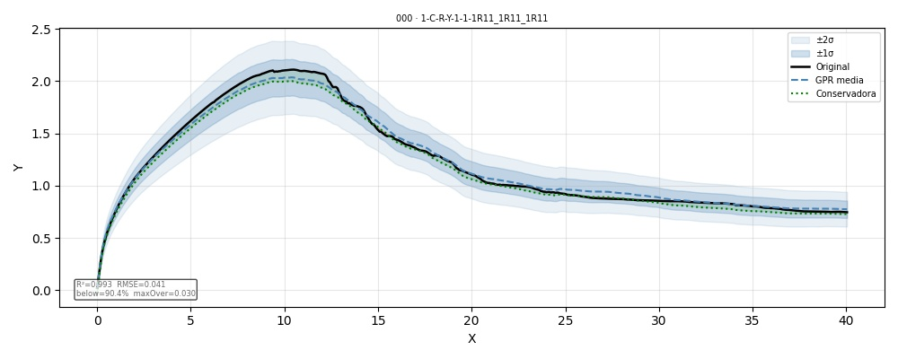

---

<!--
header: "Use case"
-->

# Step 6. Capacity curve generation

  <!-- Zoom buttons -->
  

    <button id="zoom-in" style="font-size:18px; padding:6px 10px;">+</button>
    <button id="zoom-out" style="font-size:18px; padding:6px 10px;">−</button>
  

  

---

<!--
header: "Methodology"
-->

# Step 6. Next steps

  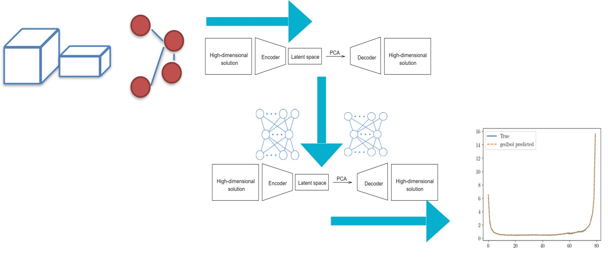

---

<!--
header: "Methodology"
-->

# Step 7. Evacuation 

Accessibility values (0-red 1-green) as a function of height and walking distance

<table style="border-collapse:collapse; width:100%; table-layout:fixed;">

<thead>
<tr>
<th style="border:1px solid #999; padding:6px;">
  Walking (m) → Height (m) ↓
</th>

<th style="border:1px solid #999; padding:6px;">50</th>
<th style="border:1px solid #999; padding:6px;">100</th>
<th style="border:1px solid #999; padding:6px;">150</th>
<th style="border:1px solid #999; padding:6px;">200</th>
<th style="border:1px solid #999; padding:6px;">250</th>
<th style="border:1px solid #999; padding:6px;">300</th>
<th style="border:1px solid #999; padding:6px;">350</th>
<th style="border:1px solid #999; padding:6px;">400</th>
<th style="border:1px solid #999; padding:6px;">450</th>
</tr>
</thead>

<tbody>

<!-- 0.0 -->
<tr>
<td style="border:1px solid #999; padding:6px;">0.0</td>
<td style="background:#ff4d4d;">0</td>
<td style="background:#ff4d4d;">0</td>
<td style="background:#ff4d4d;">0</td>
<td style="background:#ff4d4d;">0</td>
<td style="background:#ff4d4d;">0</td>
<td style="background:#ff4d4d;">0</td>
<td style="background:#ff4d4d;">0</td>
<td style="background:#ff4d4d;">0</td>
<td style="background:#ff4d4d;">0</td>
</tr>

<!-- 0.2 -->
<tr>
<td style="border:1px solid #999; padding:6px;">0.2</td>
<td style="background:#ffb84d;">0.2</td>
<td style="background:#ffb84d;">0.2</td>
<td style="background:#ffb84d;">0.2</td>
<td style="background:#ffb84d;">0.2</td>
<td style="background:#ffb84d;">0.2</td>
<td style="background:#ffb84d;">0.2</td>
<td style="background:#ffb84d;">0.2</td>
<td style="background:#ffb84d;">0.2</td>
<td style="background:#ff4d4d;">0</td>
</tr>

<!-- 0.4 -->
<tr>
<td style="border:1px solid #999; padding:6px;">0.4</td>
<td style="background:#ffcc66;">0.4</td>
<td style="background:#ffcc66;">0.4</td>
<td style="background:#ffb84d;">0.2</td>
<td style="background:#ffb84d;">0.2</td>
<td style="background:#ffb84d;">0.2</td>
<td style="background:#ffb84d;">0.2</td>
<td style="background:#ffb84d;">0.2</td>
<td style="background:#ffb84d;">0.2</td>
<td style="background:#ff4d4d;">0</td>
</tr>

<!-- 0.6 -->
<tr>
<td style="border:1px solid #999; padding:6px;">0.6</td>
<td style="background:#a6e36d;">0.6</td>
<td style="background:#a6e36d;">0.6</td>
<td style="background:#ffcc66;">0.4</td>
<td style="background:#ffcc66;">0.4</td>
<td style="background:#ffcc66;">0.4</td>
<td style="background:#ffb84d;">0.2</td>
<td style="background:#ffb84d;">0.2</td>
<td style="background:#ffb84d;">0.2</td>
<td style="background:#ff4d4d;">0</td>
</tr>

<!-- 0.8 -->
<tr>
<td style="border:1px solid #999; padding:6px;">0.8</td>
<td style="background:#7ed957;">0.8</td>
<td style="background:#a6e36d;">0.6</td>
<td style="background:#a6e36d;">0.6</td>
<td style="background:#ffcc66;">0.4</td>
<td style="background:#ffcc66;">0.4</td>
<td style="background:#ffb84d;">0.2</td>
<td style="background:#ffb84d;">0.2</td>
<td style="background:#ffb84d;">0.2</td>
<td style="background:#ff4d4d;">0</td>
</tr>

<!-- 1.0 -->
<tr>
<td style="border:1px solid #999; padding:6px;">1.0</td>
<td style="background:#2ecc71;">1.0</td>
<td style="background:#7ed957;">0.8</td>
<td style="background:#7ed957;">0.8</td>
<td style="background:#a6e36d;">0.6</td>
<td style="background:#a6e36d;">0.6</td>
<td style="background:#ffcc66;">0.4</td>
<td style="background:#ffcc66;">0.4</td>
<td style="background:#ffb84d;">0.2</td>
<td style="background:#ff4d4d;">0</td>
</tr>

</tbody>

</table>

---

<!-- _class: no-header no-margin no-footer -->

<iframe
  src="maps/tsunami_access_map.html"
  style="width: 100%; height: 100%; border: w; margin-top: 0rem">
</iframe>

---

<!-- _class: no-header no-margin no-footer -->

<iframe
  src="maps/tsunami_population_map.html"
  style="width: 100%; height: 100%; border: w; margin-top: 0rem">
</iframe>

---

<!--
header: ""
-->

# Conclusions

- Based on international and local building codes

- Building-level data with minimum or no field surveys or cadastral data

- Automated **10 out of 13** GEM attributes

- All relevant data to create fragility curves

- Fast and building specific capacity curve inference

- All relevant data to create fragility curves

- Impact and evacuation

---

# Main scientific collaborations 

- Advanced Geomatics Group (AGA), ETSI Caminos, Canales y Puertos, UPM, Madrid, Spain

- Department of Forestry and Environmental Engineering and Management, UPM, Madrid, Spain
- Institute of Transportation, TU Wien, Austria
- PIMM Laboratory, ENSAM Institute of Technology, Paris, France
- City Science Group, MIT Media Lab, Massachusetts Institute of Technology, Cambridge, USA
- Instituto Tecnológico de Santo Domingo (INTEC), Santo Domingo, Dominican Republic
- Universidad de Costa Rica (UCR), San José, Costa Rica
- Universidad de San Carlos de Guatemala (USAC), Ciudad de Guatemala, Guatemala

---

# Code and papers

- Seismic risk workflow: [SeismicBuildingExposure](https://github.com/GeomaticsCaminosUPM/SeismicBuildingExposure)

- Image vision datasets and models: [GeoImageDataset](https://github.com/GeomaticsCaminosUPM/GeoVisionDataset)

- Accessibility and evacuation: [UrbanAccessAnalyzer](https://github.com/CityScope/UrbanAccessAnalyzer)

- Paper image vision and street view height estimation: [MDPI](https://www.mdpi.com/2076-3417/13/8/5037)

- Paper transport surface estimation: [Elsevier](https://www.sciencedirect.com/science/article/pii/S2352938525000564?via%3Dihub)

- Paper footprint attributes: [Springer](https://link.springer.com/article/10.1186/s40323-026-00323-y)

---

<!--header: ""-->

# [Thesis](https://github.com/MiguelUrenaPliego/MasterThesis/blob/main/thesis.pdf)

  <a href="https://github.com/MiguelUrenaPliego/MasterThesis/blob/main/thesis.pdf">
    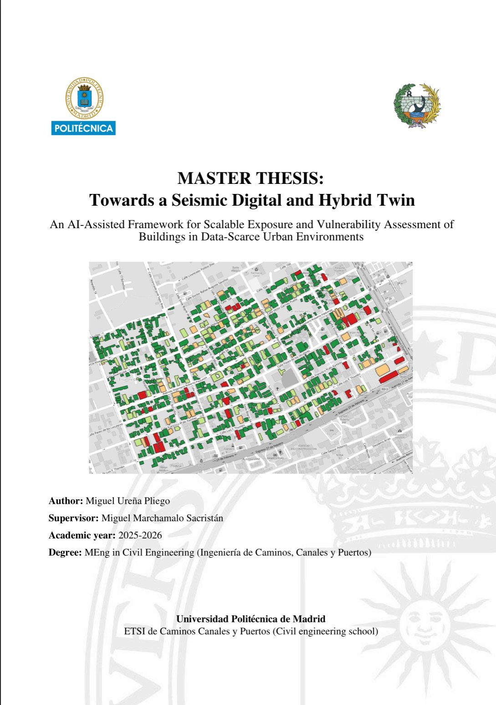
  </a>

---

<!-- _class: last two-line-logos -->

# Questions?
## Thank you!

Miguel Ureña Pliego

Contact: 
miguel.urena@alumnos.upm.es

Github: [MiguelUrenaPliego](https://github.com/MiguelUrenaPliego)
LinkedIn: [miguel-urena-pliego](www.linkedin.com/in/miguel-urena-pliego)

